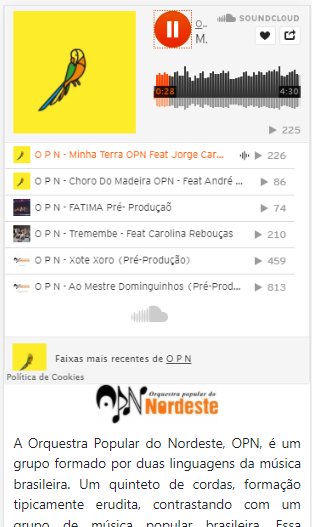
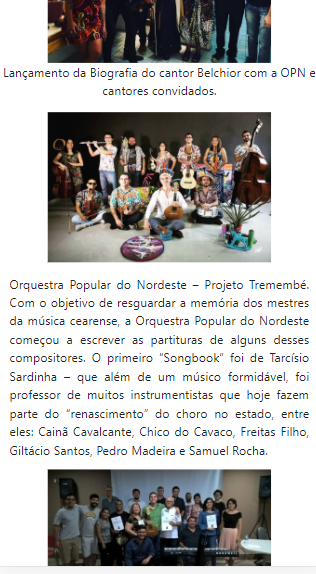
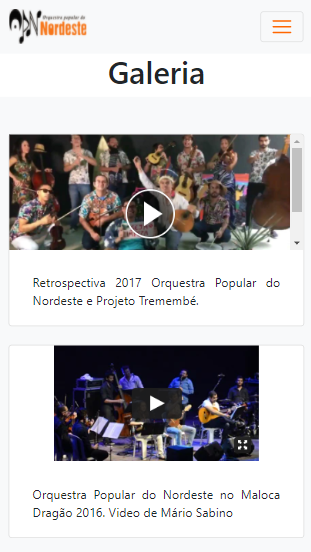

# Site-da-Orquesta-Popular-do-Nordeste
Site feito para a Orquestra Popular do Nordeste, em puro HTML, CSS e Javascript.

## Página Inicial (com componente do SoundCloud)

## Página Inicial (história da OPN)

## Galeria (vídeos)

## Conteúdo (mestres da música cearense)

## Na Mídia (reportagens e eventos)

### A OPN

A OPN faz parte do projeto Tremembé, juntando o estudo e a divulgação dos mestres da música cearense, com workshops e performances da orquestra.
